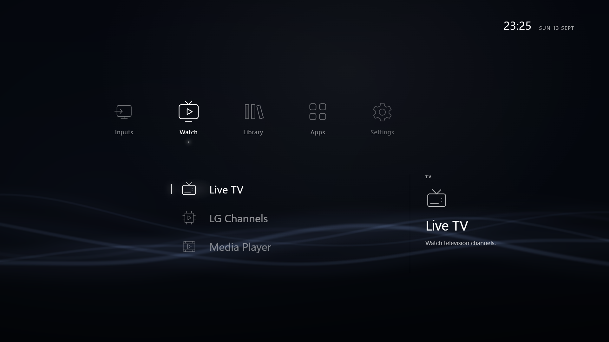

# LG-XMB

An XMB-style launcher for LG webOS TVs, based on [OpenXMB](https://github.com/phenom64/OpenXMB).
The installed app is called **Home**.



Navigate apps and inputs with the remote or pointer. Choose a background theme,
adjust the animated waves, and open LG Home from Settings whenever needed.
HDMI pictures are cached by an optional root helper; live previews are opt-in
because they can change HDR mode. The launcher does not include a media player
or emulator.

HDMI names follow the TV's input labels when its input service allows the read.
Names refresh at startup and when returning to Home; the port number remains
visible in the details. Unavailable reads keep the default or last known name.
This feature does not need the root helper or change names on the TV.

## Compatibility

Development targets **webOS 22–26**. Version 0.1.11 was tested on an **LG C5 with
webOS 10.3.1**; the target range is not a claim that every version works.
See the [compatibility and test matrix](docs/COMPATIBILITY.md).

The launcher can be installed through Developer Mode or an existing homebrew
setup. Home-button assignment, cached pictures and background controls require
the bundled helper, prepared automatically through Homebrew Channel. Its native
integrations are still C5-specific; a working menu is not a compatibility test.

## Install

Download the `.ipk` from [Releases](https://github.com/Ripthulhu/LG-XMB/releases),
then follow [Installation](docs/INSTALLATION.md) to install it with **webOS Dev
Manager**. Installing the launcher alone does not change the Home button.
Rooted installations prepare their helper on first launch. Recovery is covered in
the same guide.

Releases include the installable IPK, SHA-256 checksums and matching source.
**0.1.12 is a C5 prerelease**, not a stable or broadly compatible release; read its
known limitations before installing. Unpublished development builds remain in
GitHub Actions as `lg-xmb-candidate` after **Checks** succeeds.

## Develop

Use Node.js 20 or newer. The Node requirement is for your computer, not the TV.

```sh
npm ci --ignore-scripts --no-audit --no-fund
npm run preview
```

Open <http://127.0.0.1:8765>. Desktop TV actions are simulated.

```sh
npm test
npm run package
npm run verify:package
```

The package is written to `dist/`. Nothing is installed on a TV by these commands.
For the tools linked by webOS Homebrew, `npm run tools:download` downloads a
pinned, checksum-verified `ares-cli-rs` archive into `.tools/`. It does not extract
or run it. The existing `@webos-tools/cli` remains the release packager.

See [Contributing](CONTRIBUTING.md) for browser tests, Python tests and change
review. The native C/C++ SDK is not needed for this HTML/JavaScript application.

## License

GNU GPL v3; files permitting later versions retain that permission. Upstream
copyright and license notices are retained in [LICENSE](LICENSE),
[third-party notices](THIRD-PARTY-NOTICES.md), and [wave provenance](WAVE-PROVENANCE.md).
This project is not affiliated with LG or Sony.

The wave background uses a PS3-style spline surface with an OpenXMB/Canvas fallback.
See [renderer provenance](WAVE-PROVENANCE.md) for sources and limitations.
